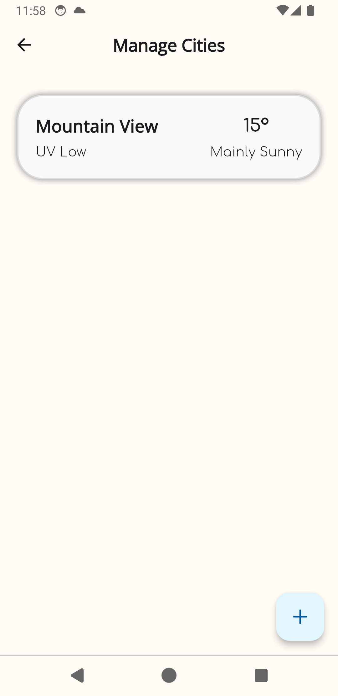
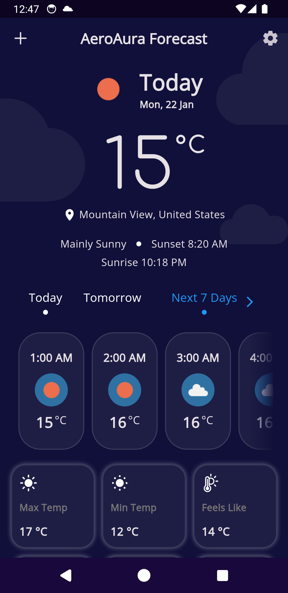
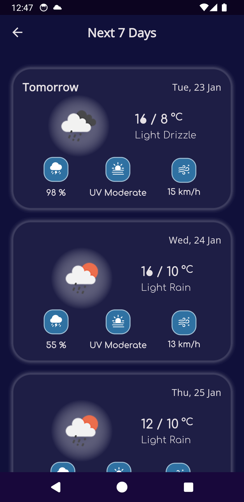
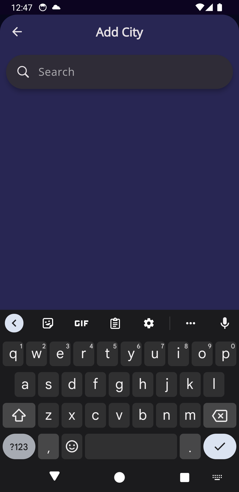

<div align="center">
   
   <h1>Aero Aura - Unleash the Weather</h1>
</div>
<div align="center">


<p align='center'>
 <p align='center'>
    <a href='https://github.com/Gaurav-Kushwaha-1225/AeroAura/stargazers'></a>
    <a href='https://github.com/Gaurav-Kushwaha-1225/AeroAura/forks'></a>
    <a href='https://github.com/Gaurav-Kushwaha-1225/AeroAura/blob/master/LICENSE'></a>
 </p>
</p>
</div>

<p align='center'> Sky’s the Limit: Weather Insights with Flutter. 🌦️<br> Always with you, rain or shine. Get temperature, forecast and next 7 days weather for your city. </p>

### 🌍 Be aware of the weather

With Aero Aura, you can explore the weather in your city and beyond. We offer an array of features to keep you informed and prepared:

- 🌟 **View Current Weather:** Stay up-to-date with real-time weather conditions in your area.
- 🌅 **View Weather by Hour:** Plan your day effectively with hourly forecasts.
- 📆 **View the Weather for the Week:** Get a week-long weather outlook at your fingertips.
- 🌡️ **View Detailed Weather Data:** Dive deep into weather statistics for a comprehensive understanding.
- 📲 **Cross-platform support** (Currently Android & Windows based devices).
- 💥 **Auto Theme Switcher** Theme automatically switches based on your device Theme Mode.
- 🎨 **Beautiful Design**

This application has an aesthetically pleasing design.

### 🌐 Reliable Data Sources

We fetch weather data from [Open-Meteo](https://open-meteo.com/en/docs) and use [Open-Meteo's Geocoding API](https://open-meteo.com/en/docs/geocoding-api) to help you find cities easily.

---

### 🏞️ Display Banner

<div align="center">
  
</div>

---

### ⚒️ Dependencies

<details>
     <summary> Click to expand </summary>
     
* [http](https://pub.dev/packages/http)
* [geolocator](https://pub.dev/packages/geolocator)
* [geocoding](https://pub.dev/packages/geocoding)
* [intl](https://pub.dev/packages/intl)
* [go_router](https://pub.dev/packages/go_router)
* [page_transition](https://pub.dev/packages/page_transition)
* [shared_preferences](https://pub.dev/packages/shared_preferences/versions/2.2.2)
* [sqflite](https://pub.dev/packages/sqflite/versions/2.3.2)
* [provider](https://pub.dev/packages/provider/versions/6.1.2)
     
</details>

---

### 📷 Screenshots

|       |       |       |       |
| --------------------------------------------- | -------------------------------------------- | ------------------------------------------- | ---------------------------------------------- |
|  |  |  |  |
|         |   |        |

---

### ☑️ Current TODOs

- [ ] 🌆 **Choose Your City Option:** Set your location or add other cities to your list.
- [ ] 🧮 **Flexible Measurement Units:** Customize your measurement system for temperature and more.
- [ ] 🌡️ **Celsius or Fahrenheit:** Pick your preferred temperature unit.
- [ ] 🕰️ **12-Hour or 24-Hour Time Formats:** Adjust the time display to your liking.
- [X] **~~Theme switcher~~** ~~(Light and dark mode using a toggle button in settings page.)~~
- [X] **~~Add Directory Structure to README.md~~**
- [ ] **~~Add an App Icon and~~ a Presentation Video for the App.**

---

### Directory Structure
  
```
|-- lib
|   |-- models
|   |   |-- location.dart
|   |   |-- weather.dart
|   |-- screens
|   |   |-- add_city_page
|   |   |   |-- local_widgets
|   |   |   |-- add_city_page.dart
|   |   |-- home
|   |   |   |-- local_widgets
|   |   |   |-- home.dart
|   |   |-- next_7_days
|   |   |   |-- local_widgets
|   |   |   |-- next_7_days.dart
|   |   |-- search_city_page
|   |   |   |-- local_widgets
|   |   |   |-- search_city_page.dart
|   |   |-- settings_page
|   |   |   |-- local_widgets
|   |   |   |-- provider
|   |   |   |-- settings_page.dart
|   |-- services
|   |   |-- location_service.dart
|   |   |-- weather_service.dart
|   |-- utils
|   |   |-- consts.dart
|   |   |-- functions.dart
|   |   |-- previous_data.dart
|   |   |-- routes.dart
|   |   |-- routes_consts.dart
|   |   |-- themes.dart
|   |   |-- wmo_code_to_comment.dart
|   |-- widgets
|   |   |-- SizedBoxInSliver.dart
|   |-- main.dart
|
|-- pubspec.yaml
```

---

### 📃 License

This project is licensed under the [MIT License](./LICENSE).

---

### 👨🏻‍💻 Connect with me

<p align="left">
   
<a href="https://twitter.com/GauravKush1225" target="blank"></a>
<a href="https://www.linkedin.com/in/gaurav-kushwaha-330a39251/" target="blank"></a>
<a href="https://www.instagram.com/kush.gaurav12/" target="blank"></a>
<a href="https://www.youtube.com/@gauravkushwaha7207" target="blank"></a>

</p>
